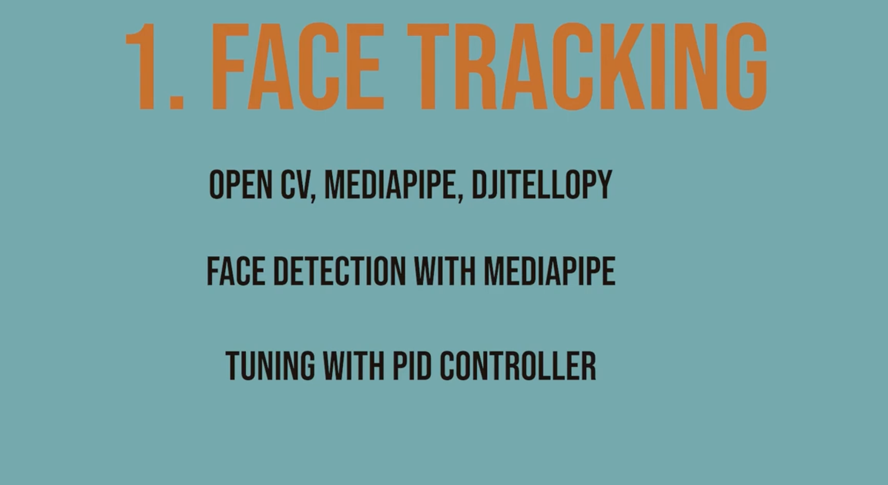
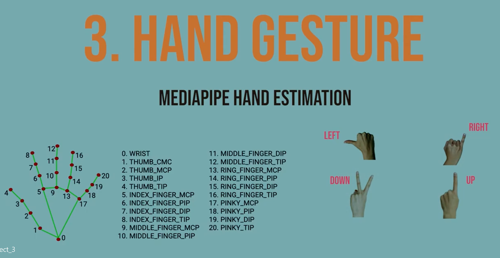
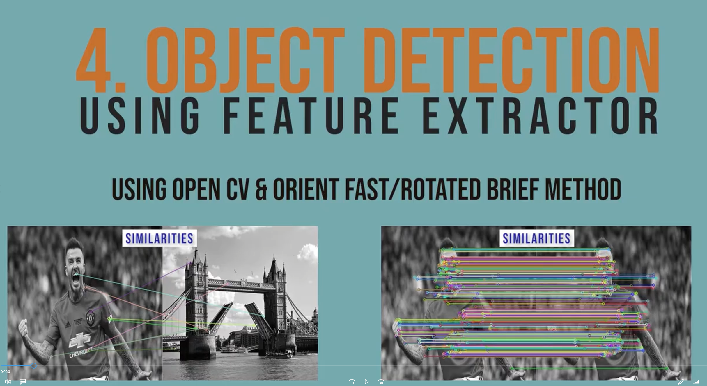
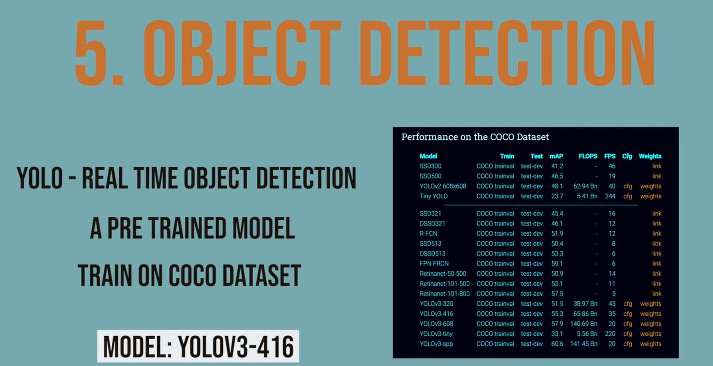

# computer_vision_with_tello_drone

# Five Projects using Tello Drone
 <a href="https://youtu.be/Yv_TCvUnTdY"> >>> Click Here: YouTube link <<<</a>

## Table of Contents
1. <a href="#installations" >Installations</a>
2. <a href="#project_1" >Project 1: Face Tracking</a>
3. <a href="#project_2" >Project 2: Body Tracking & Control</a>
4. <a href="#project_3" >Project 3: Hand Geusture & Control</a>
5. <a href="#project_4" >Project 4: Object Detection: Basics</a>
6. <a href="#project_5" >Project 5: Object Detection: YOLO</a>


   
### Installations
<div id="installations"></div>
 
To install ImageAI, run the python installation instruction below in the command line:

- [Download and Install](https://www.python.org/downloads/) **Python 3.10 or higher**
- Clone repository
  - **Clone Repository**: Link [Click here](https://github.com/mrsojourn/computer_vision_with_tello_drone.git)
    or
    ```
    git clone https://github.com/mrsojourn/computer_vision_with_tello_drone.git 
    ```

  - **Install requirements**: Download [requirements.txt](https://github.com/mrsojourn/computer_vision_with_tello_drone/blob/main/requirements.txt) file and install via the command
    of
    ```
    pip install -r requirements.txt
    ```
  - Run individual projects and ENJOY =)

### Projects 1
<div id="project_1"></div>
<table>
  <tr>
    <td><h2> Tello: Face Tracking</h2> </td>
  </tr>
  <tr>
    <td>
    <h4>Frace tracking demo video.</h4>
    <a href="https://youtu.be/nlfS8t8BqY8"> >>> Click Here: YouTube link <<<</a>
    </td>
  </tr>
</table>

### Projects 2
<div id="project_2"></div>
<table>
  <tr>
    <td><h2> Tello: Body Tracking & Control</h2> </td>
  </tr>
  <tr>
    <td>
    <h4>Body Tracking & Control demo video.</h4>
    <a href="https://youtu.be/8PK3BrQf54s"> >>> Click Here: YouTube link <<<</a>
    </td>
  </tr>
</table>
   
### Projects 3
<div id="project_3"></div>
   <table>
  <tr>
    <td><h2> Tello: Hand Gesture Control</h2> </td>
  </tr>
  <tr>
    <td>
    <h4>Hand gesture & control demo video.</h4>
    <a href="https://youtu.be/cVeWmBykW4I"> >>> Click Here: YouTube link <<<</a>
    </td>
  </tr>
</table>
      
### Projects 4  
<div id="project_4"></div>
      <table>
  <tr>
    <td><h2> Tello: Objection Detection Basics</h2> </td>
  </tr>
  <tr>
    <td>
    <h4>Object dections basics demo video.</h4>
    <a href="https://youtu.be/iA-cvK-Xydo"> >>> Click Here: YouTube link <<<</a>
    </td>
  </tr>
</table>
         
### Projects 5
<div id="project_5"></div>
<table>
  <tr>
    <td><h2> Tello: Object Detection: YOLO</h2> </td>
  </tr>
  <tr>
    <td>
    <h4>Objection detection YOLO demo video.</h4>
    <a href="https://youtu.be/CYfCtVhx7qk"> >>> Click Here: YouTube link <<<</a>
    </td>
  </tr>
</table>
